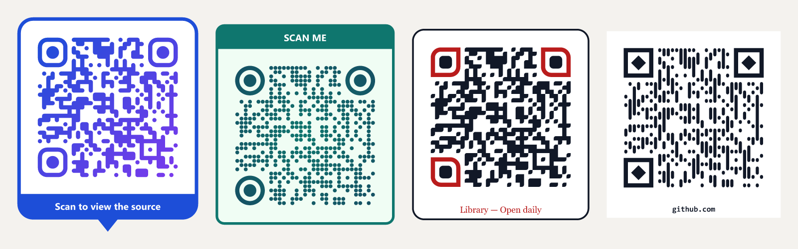

# QR Studio

Make QR codes for links and style them: pattern, colors, caption and frame. Export as PNG or SVG.
Everything runs in your browser — no server, no tracking, and your link never leaves your device.



## Features

- **Live preview** as you type. Adds `https://` when you leave it out; rejects non-web links (`javascript:`, `data:`, `mailto:`…) and links over 1,000 characters.
- **Patterns**: 8 module styles (square, dots, rounded, connected, leaf, diamond, vertical, horizontal), 4 corner-square styles and 4 corner-dot styles.
- **Colors**: solid, linear gradient (any angle) or radial gradient; separate corner colors; transparent background.
- **Caption**: up to 60 characters, above or below the code, 4 fonts with full Vietnamese support, size, weight and color.
- **Frames**: none, square, rounded, label band, speech bubble. Frames with a band default to "SCAN ME" and pick black or white text automatically.
- **Export**: PNG at 512 / 1024 / 2048 / 4096 px wide, SVG with the font embedded, or copy the image to the clipboard. Files are named after the domain, e.g. `qr-example.com.png`.
- **Scannability warnings** for low contrast, inverted colors and very long links. Error correction is fixed at level Q (~25%), and the quiet zone can't be removed.
- **Interface in English (default) or Vietnamese**, remembered per browser.

## Run it

```bash
npm install
npm run dev        # http://localhost:5173
npm run build      # static site in dist/ — deploy to any static host
```

## Tests

The tests render real QR codes and decode them again, printing what was read so you can check it yourself.

```bash
npm run verify             # URL validation cases + 91 design combinations decoded with ZXing (and jsQR for reference)
npm run verify -- --png    # also writes sample images to scripts/out/
```

End-to-end in the browser: run `npm run dev` and open `/scripts/e2e.html` (add `?url=...` to try your own link). It exports PNGs through the app's own code path, embedded fonts included, and decodes each one with ZXing.

`npx tsx scripts/samples.ts` regenerates `docs/samples.png`.

## How it works

QR Studio uses [`qrcode-generator`](https://github.com/kazuhikoarase/qrcode-generator) only for the module matrix. Shapes, gradients, frames and captions are drawn as one SVG string (`src/render.ts`); the PNG is that same SVG rasterized on a canvas, so both formats always match. The frame and caption are laid out outside the QR's quiet zone, so they never cover the code.

```
src/url.ts      validate and normalize the link
src/qr.ts       QR matrix (error correction Q)
src/shapes.ts   SVG paths for module and corner styles
src/layout.ts   layout of code + frame + caption
src/render.ts   design → SVG string
src/checks.ts   contrast / inversion / length warnings
src/fonts.ts    caption fonts + font embedding on export
src/export.ts   PNG/SVG download, clipboard copy
src/i18n.ts     English / Vietnamese strings
src/ui.ts       controls
```

## Project docs (Vietnamese)

The app was built with a use-case-driven workflow. The specification and the latest check of the code against it are in Vietnamese:

- [use-cases.md](use-cases.md) — the spec (source of truth)
- [plan.md](plan.md) — technical plan
- [gap-analysis.md](gap-analysis.md) — code vs. spec, with test evidence

## License

[MIT](LICENSE)
